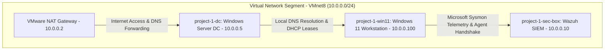
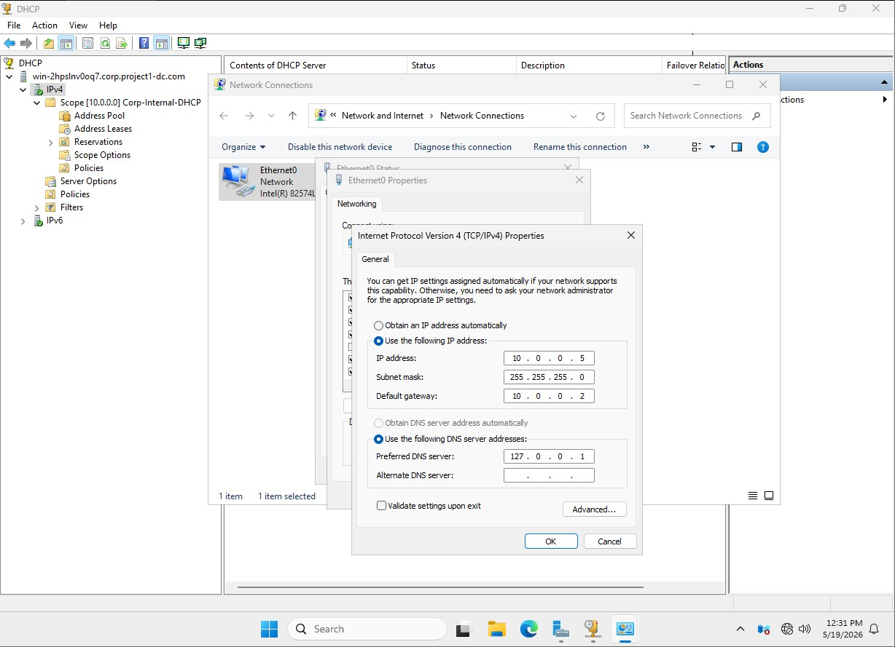
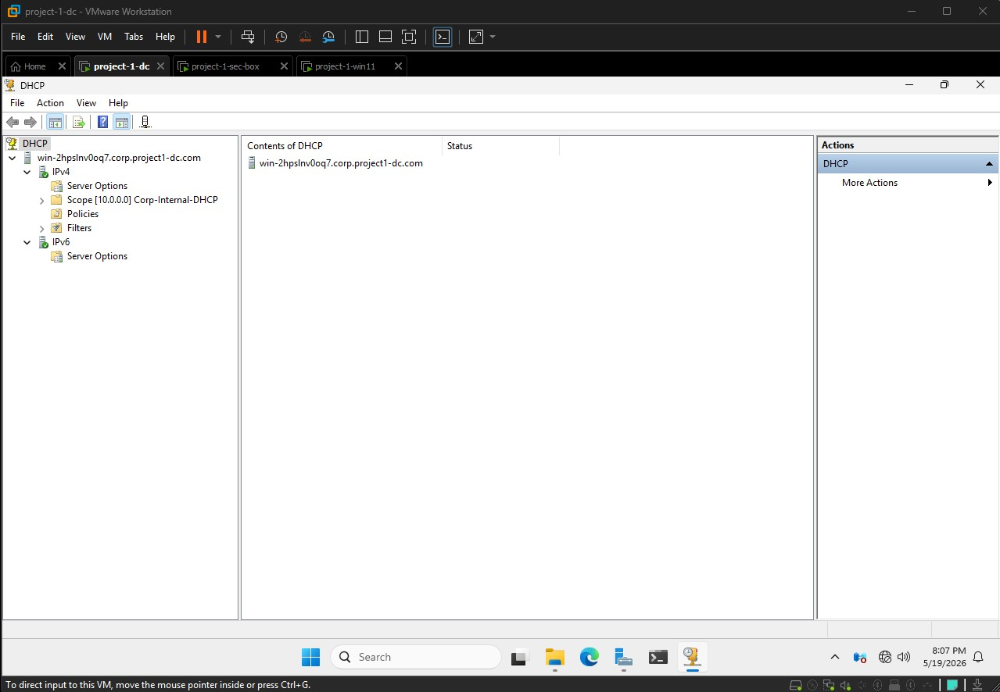
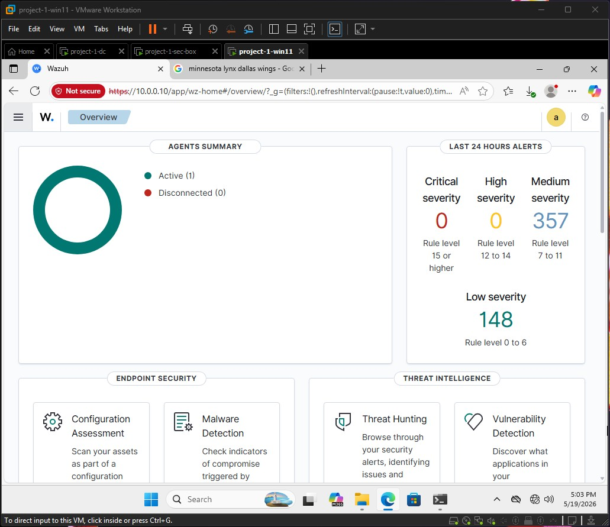
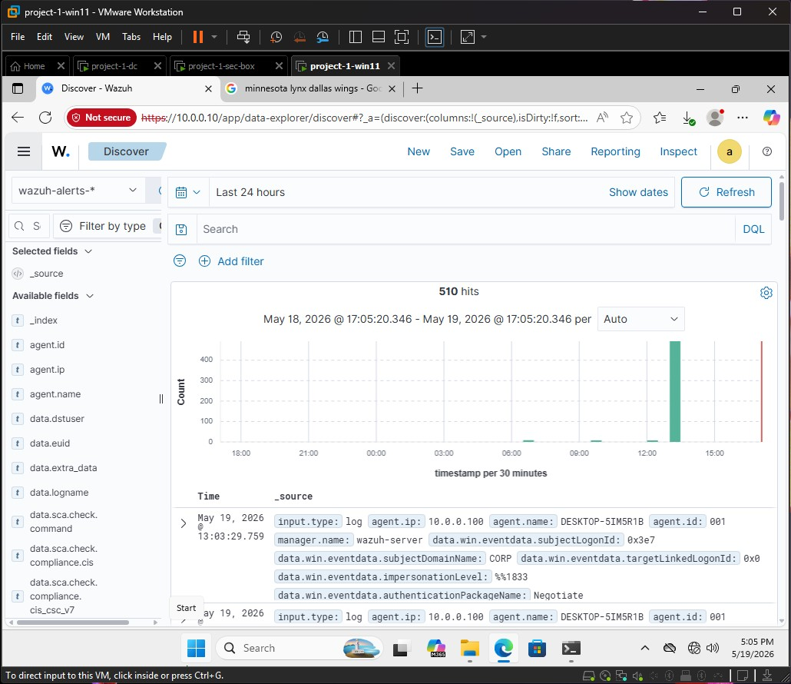

# Enterprise Security Monitoring Lab: Active Directory & Wazuh SIEM

## 📌 Project Overview
This project demonstrates the hands-on design, deployment, and configuration of an isolated enterprise network environment utilizing **Active Directory Domain Services (AD DS)**, advanced endpoint telemetry via **Microsoft Sysmon**, and centralized security event logging using **Wazuh SIEM (Security Information and Event Management)**. 

The primary objective of this lab was to engineer a complete, end-to-end detection pipeline, simulating how corporate security operations centers (SOCs) maintain granular visibility across distributed endpoint assets.

---

## 🏗️ Infrastructure & Topology
The entire infrastructure was virtualized inside **VMware Workstation Pro**, utilizing a custom internal NAT virtual network switch layout to isolate and manage routing.

| Asset Name | Operating System | IP Address | Roles / Installed Applications |
| :--- | :--- | :--- | :--- |
| **project-1-dc** | Windows Server 2025 Standard | `10.0.0.5` | AD DS, Domain Controller, DNS Server, Authorized DHCP Server |
| **project-1-win11** | Windows 11 Education (25H2) | `10.0.0.100` | Domain-joined Workstation (`DESKTOP-5IM5R1B`), Microsoft Sysmon, Wazuh Agent |
| **project-1-sec-box**| Ubuntu Linux (Wazuh OVA v4.10) | `10.0.0.10` | Wazuh Indexer, Server Daemon, and Security Dashboard Portal |

Below is the logical flow of the infrastructure network segment, routing boundaries, and telemetry ingestion pipelines:

## 🚀 Deployment Milestones & Engineering Challenges

### 1. Active Directory & Core Network Architecture
* **Forest Provisioning:** Deployed Active Directory Domain Services to establish the true enterprise root namespace: `corp.project1-dc.com`.
* **Static Addressing:** Hardcoded the network adapter configurations on the Domain Controller to bind identity authentication tokens securely across the local switch.
* **DHCP Authorization Overrides:** Encountered and mitigated `Access Denied (WIN32 5)` authorization errors within Server Manager caused by cached local administrative session tokens. Bypassed UI constraints by executing elevated PowerShell scripts (`Add-DhcpServerInDC`) under a validated domain administrator context to bind DHCP scopes directly to the Active Directory schema.
* **DNS Resolution Mapping:** Configured primary DNS zones locally on the domain controller, establishing `8.8.8.8` public forwarders paired with global VMware NAT Gateway overrides (`10.0.0.2`) to safely allow external web traffic into the internal lab.

### 2. High-Fidelity Endpoint Telemetry (Sysmon)
* Standard Windows Security Event logs miss stealthy execution vectors. To bridge this gap, **Microsoft Sysmon64** was successfully deployed to the Windows 11 workstation.
* Implemented the industry-standard **SwiftOnSecurity Sysmon-Config** XML template, applying rule logic to surface process creation (Event ID 1), file time modifications, and network connections while tuning out benign system noise.

### 3. SIEM Ingestion & Pipeline Integration
* Accessed the central Wazuh manager node console via `https://10.0.0.10` inside the environment.
* Deployed the light-weight Windows Wazuh Agent script via an administrative PowerShell terminal.
* Initialized the background service telemetry stream (`NET START Wazuh`), establishing an encrypted cryptographic tunnel back to the SIEM stack.

---

## 📊 Verification & Visual Evidence

### Core Network Infrastructure
*Statically assigning the enterprise gateway boundaries on the Domain Controller to anchor local infrastructure routing:*

*The successfully authorized domain infrastructure, showing green checkmarks indicating full Active Directory integration:*

### Active SIEM Agent Synchronization
*The exact moment the Windows 11 workstation (`DESKTOP-5IM5R1B`) successfully registered and completed its handshake with the SIEM manager:*

### High-Volume Log Telemetry Stream
*Proof of ingestion: Within minutes of activating the endpoint agent, hundreds of enriched Sysmon log payloads were successfully captured, categorized, and made available for live parsing inside the SIEM dashboard:*

---

## 🧠 Key Cyber Engineering Takeaways
* **Deep Architectural Visibility:** Mastered the intrinsic operational relationship between Active Directory authentication and core enterprise networking fundamentals (DNS namespaces, DHCP lease scopes, and static gateways).
* **Telemetry Tuning:** Learned how to deploy and configure advanced host-based monitoring templates to isolate high-noise endpoint logs and surface high-fidelity data indicators.
* **Troubleshooting Resilience:** Successfully debugged cross-virtual networking drops, local permissions structures, and guest-host isolation layers by pivoting between CLI terminals, manual routing maps, and system console configurations.
